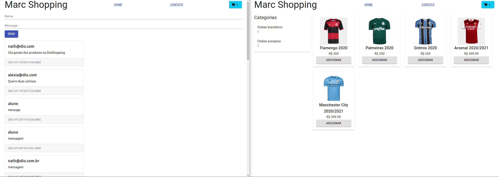

# Marc Shopping

Projeto criado durante o Bootcamp Inter Frontend Developer na DIO [https://www.dio.me](https://www.dio.me/), Integrando um Backend em Node.js com um Frontend em React para um E-commerce, com a instrução de Nathally Souza [https://github.com/nathys](https://github.com/nathys)

Projeto consiste em uma aplicação de E-commerce sendo integrada ao Backend com um serviço de mensagns em tempo real.

## Tecnologias aplicadas

- material-ui/core
- material-ui/icons
- react-router-dom
- react-redux
- redux

---

